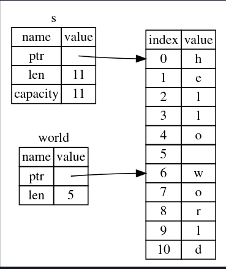

## References
- consists of an address
- like pointers, but always point to a valid value
- a way to give a function access to a value without taking [[Ownership]]
```rust
fn calculate_length(s: &String) -> usize {
    s.len()
}
```
the variable `s` is a reference!
- compiler error if `s` doesn't point to a value

you can't modify references by default! But you can make them mutable!
```rust
fn crying(str: &mut String) {
	str.push_str(" crying.");
}
```
- Mutable referencs: you can only have one mutable reference at a time!
	- a write lock
- cannot have a mutable reference when you already have an immutable reference
	- can't be sure of a value when you have a write lock on it

#### Avoiding Dangling References
- Rust compiler will prevent dangling references

From the Rust Book: 

### [The Rules of References](https://doc.rust-lang.org/book/ch04-02-references-and-borrowing.html#the-rules-of-references)

Let’s recap what we’ve discussed about references:

- At any given time, you can have _either_ one mutable reference _or_ any number of immutable references.
- References must always be valid.


# Slice
- a reference that lets you reference a sequence of items in a collection (without refing the whole collection)

**What problem to slices solve?**
Here's a problem slices can solve: *write a function that takes a string of words separated by spaces and returns the first word it finds in that string. If the function doesn’t find a space in the string, the whole string must be one word, so the entire string should be returned.*

without slices
```Rust
fn first_word(s: &String) -> usize {
    let bytes = s.as_bytes(); // need to convert to bytes to iterate

    for (i, &item) in bytes.iter().enumerate() {
    //iter() returns array as an array of tuples with (index, reference)
        if item == b' ' {
            return i; //returns the index on its own.
            //this can be a problem
            //the programmer still has to obtain the part of the word y applying the index
            //the state is also not connected. The value of i will not change if the string changes
        }
    }

    s.len()
}

```


### A string slice
```rust
    let s = String::from("hello world");

    let hello = &s[0..5];
    let world = &s[6..11];

	let hello_fromfront = &s[..5];
	let world_toend = &s[6..];

	let entire_str = &s[..];

	//slice indicies must occur between valid utf-8 characters, cant cut a byte in half
```

- like a string object, but the starting location and the length is different

with slices, we can return the first word of the string like this!
```rust
return &s[0..i];
```
- compiler will now ensure our reference remains valid
- won't allow any mutable borrows while the slice remains active!
```
$ cargo run
   Compiling ownership v0.1.0 (file:///projects/ownership)
error[E0502]: cannot borrow `s` as mutable because it is also borrowed as immutable
  --> src/main.rs:18:5
   |
16 |     let word = first_word(&s);
   |                           -- immutable borrow occurs here
17 |
18 |     s.clear(); // error!
   |     ^^^^^^^^^ mutable borrow occurs here
19 |
20 |     println!("the first word is: {word}");
   |                                  ------ immutable borrow later used here

For more information about this error, try `rustc --explain E0502`.
error: could not compile `ownership` (bin "ownership") due to 1 previous error
```
- `first_word()` is where the slice is created

#### String literals are slices
- basically they are slices pointing to a specific point in the binary

#### Passing in a string slice
- it is a good idea to accept a `&str` (string slice) so you can either pass in an entire string as a slice (`&s[..]`) or a slice of a string

you can also slice arrays!

